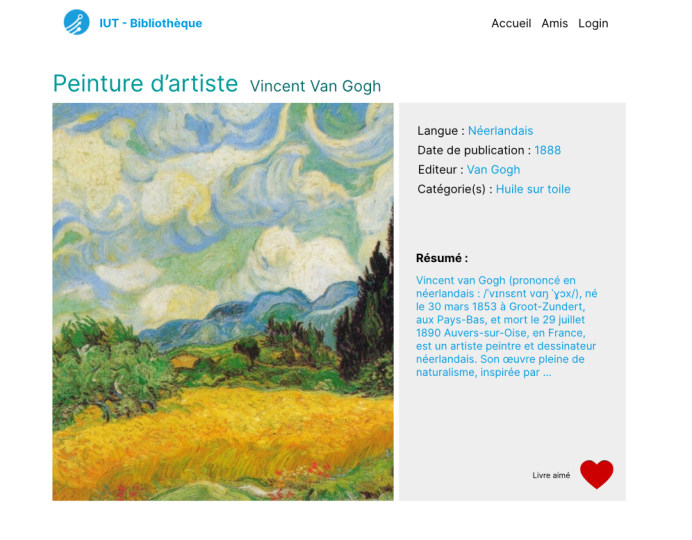

# BiblioTech groupe 1

## Table des matières

- [Présentation](#présentation)
    - [Description](#description)
    - [Développeurs](#développeurs)
  - [Installation](#installation)
    - [Symfony](#symfony)
    - [Node js](#node-js)
- [Nouvelles fonctionnalités proposées](#nouvelles-fonctionnalités-proposées)
  - [Fonctionnalités pour les nouvelles lectures](#fonctionnalités-pour-les-nouvelles-lectures)
  - [Ordonner les comptes à suivre qui sont proposés](#ordonner-les-comptes-à-suivre-qui-sont-proposés)

# Présentation

### Description
Notre projet est une bibliothèque en ligne, vous pouvez emprunter des livres et les partager avec vos amis. Il propose également des recommandations de livres à lire.

### Développeurs
- Tristan Restali: CI/CD, Back-end,
- Mathis Foussac: CI/CD, Back-end,
- Robin Pluviaux: CI/CD, Front-end,
- Issiaka Cissokho: Base de données, Front-end,
- Gaëtan Berisset: Base de données, Back-end,
- Lucas Jacquemard: Base de données, Back-end.

## Installation
Avant de pouvoir lancer le projet il vous faut démarer le serveur et démarer l'application.

### Symfony
Pour démarer le serveur il faut tout d'abord aller dans le dossier back.

Puis il vous faut paramétrer les liens de connexion à la base de données dans .env.local et dans .env.test .

Ensuite il faut lancer les commandes suivantes dans un terminal:
- composer update
- composer install 
  
Pour finir il vous suffit de lancer le serveur symfony sur le port 8000.

Pour cela lancer cette commande dans un terminal:
- symfony serve

### Node js
Pour démarer l'application il faut tout d'abord aller dans le dossier front.

Puis dans un terminal executer les commandes suivantes dans in terminal:
- npm install
- npm start

# Nouvelles fonctionnalités proposées

## Fonctionnalités pour les nouvelles lectures

Nous proposons d'implémenter une fonctionnalité permettant aux utilisateurs d'aimer un livre. Elle serait présente au niveau de la page d'affichage du livre.
Image d'un livre non aimé par un utilisateur:

 

Image d'un livre aimé par un utilisateur:

 

 Cette fonctionnalité nous permettra aussi de proposer de nouvelles lectures personalisées aux utilisateurs.
 Ces nouvelles lectures seront proposées en fonction des auteurs des livres que les utilisateurs ont aimés, c'est-à-dire que nous proposerons des livres du même auteur que les livres que les utilisateurs à aimés.
 Ces lectures seront afficher sur la page d'acceuil comme présenté ci-dessous:

 

## Ordonner les comptes à suivre qui sont proposés

Pour la fonctionnalité de proposition d'amis, nous avons pensés de les proposer dans la page amis de l'utilisateur comme le montre l'image ci-dessous:

Les amis recommendés seraient choisis en fonction des auteurs des livres que l'utilisateur a aimés. C'est-à-dire que les amis proposés seraient des utilisateurs qui ont aimés des livres écrits par des auteurs que l'utilisateur à aussi aimé.

Comme le présente l'image ci-dessous:

